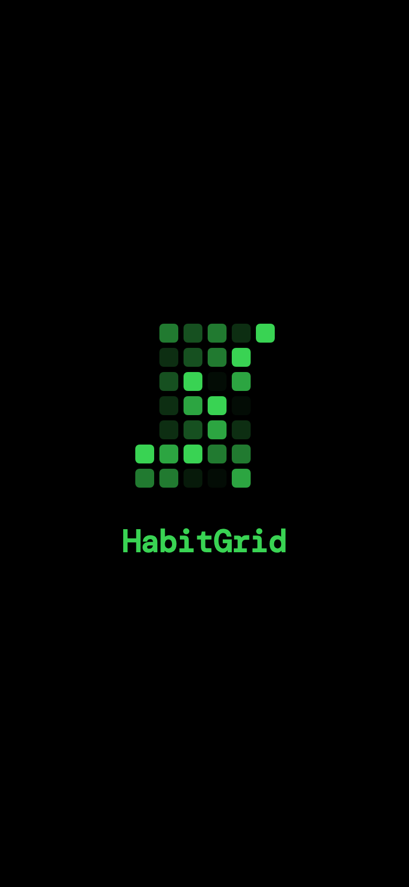
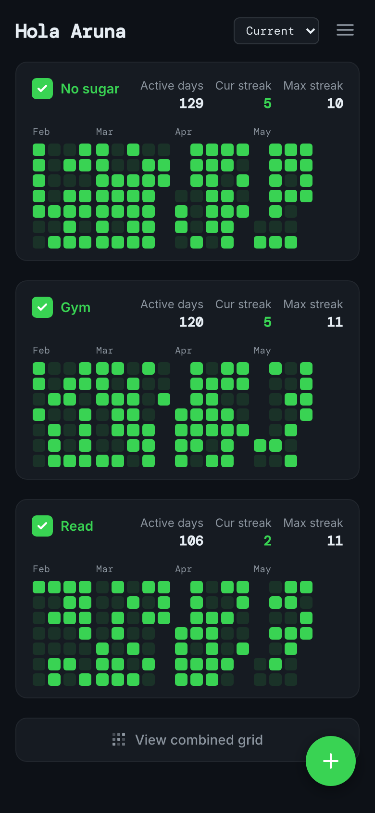
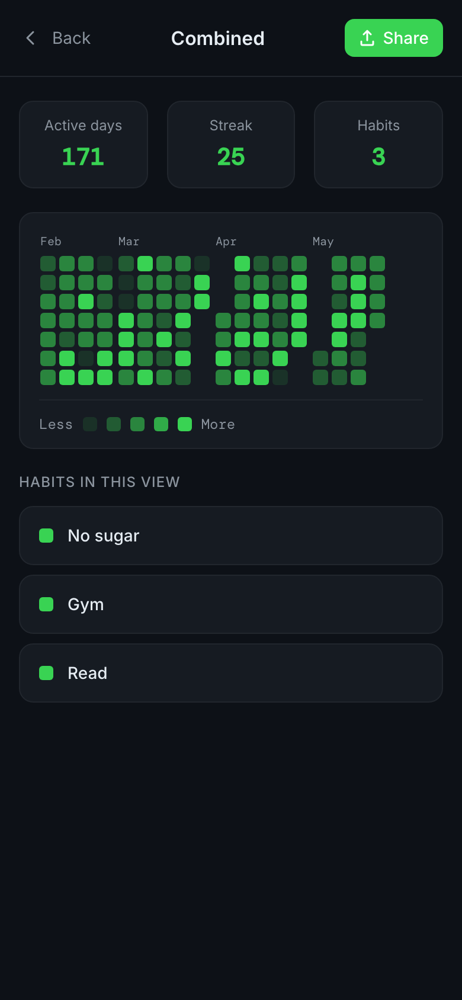
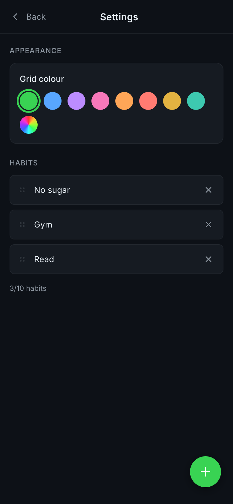
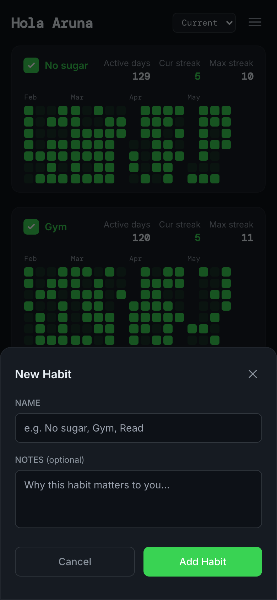

# HabitGrid

A GitHub/LeetCode-style habit tracker PWA. Build streaks, visualise consistency, and share your progress — all stored locally, no account needed.

🔗 **[habitgrid.vercel.app](https://habitgrid.vercel.app)**

<p align="center">
  
  
  
  
</p>

---

## Features

- **Contribution grids** — each habit gets its own month-block grid, styled after LeetCode's dark-mode palette
- **Per-habit check-in** — tap the checkbox next to a habit name to log today; the cell fills instantly
- **Backdate yesterday** — missed logging last night? tap yesterday's cell to fill it in
- **Stats per habit** — active days, current streak, and max streak shown inline on every card
- **Year selector** — switch between the rolling 12-month view and any past calendar year
- **Combined grid** — merge all habits into one intensity-shaded grid (darker = fewer habits done, brighter = all done)
- **Share as PNG** — exports a clean card image via the native share sheet; falls back to download on desktop
- **Custom accent colour** — pick from 8 presets or use the native colour picker; the grid, UI, and splash all update instantly
- **Splash screen** — black background with a flickering matrix of the current month's grid on every launch
- **Private notes** — attach a personal memo to each habit; stored locally, never shown publicly
- **Profile** — set your name to personalise the greeting
- **Backup & restore** — export your data as a JSON file; restore on any device
- **Installable PWA** — add to home screen on iOS/Android for a native-feeling experience

---

## Pro

HabitGrid is free for up to 3 habits. **HabitGrid Pro** ($4.99, one-time) unlocks:

- Unlimited habits
- Full colour palette + custom picker
- Combined grid view

---

## Screenshots

| Splash | Main grid | Add habit | Combined |
|--------|-----------|-----------|----------|
|  |  |  |  |

| Settings (colour picker) | Profile |
|--------------------------|---------|
|  |  |

---

## Tech stack

| Layer | Choice |
|-------|--------|
| Framework | React 18 + TypeScript |
| Build tool | Vite 4 |
| State / persistence | Zustand with `persist` middleware → localStorage |
| Styling | Tailwind CSS v3 + inline CSS variables for theming |
| PWA | `vite-plugin-pwa` + Workbox (cache-first, auto-update) |
| Share image | Canvas API drawn programmatically — no extra deps |
| Payments | Dodo Payments (one-time license key) |
| Hosting | Vercel |

---

## Local development

```bash
# Node 18+ required
git clone https://github.com/aruna09/habitgrid.git
cd habitgrid
npm install
npm run dev        # http://localhost:5173
```

### Build for production

```bash
npm run build      # output in dist/
npm run preview    # preview the built PWA locally
```

### Environment variables

| Variable | Description |
|---|---|
| `DODO_API_KEY` | Dodo Payments API key (server-side) |
| `VITE_DODO_CHECKOUT_URL` | Dodo checkout URL for Pro purchase |
| `DODO_TEST_MODE` | Set to `true` to use Dodo test environment |

---

## Data & privacy

Everything lives in your browser's `localStorage` under the key `habitgrid-storage`. The only data that ever leaves your device is your license key — sent once to verify your Pro purchase. Nothing else is sent to any server.

[Full privacy policy →](https://habitgrid.vercel.app/privacy.html)

---

## Roadmap

### Shipped
- [x] GitHub-style contribution grids per habit
- [x] Combined intensity grid across all habits
- [x] Share progress as PNG
- [x] Custom accent colour theming
- [x] Backdate up to yesterday
- [x] Backup & restore (JSON export/import)
- [x] HabitGrid Pro — freemium with Dodo Payments

### Coming
- [ ] Streak notifications / reminders
- [ ] Friend codes — share a read-only view of your grid
- [ ] Widget (iOS 16+ WidgetKit via PWA)
- [ ] Cloud sync (optional, paid add-on)
